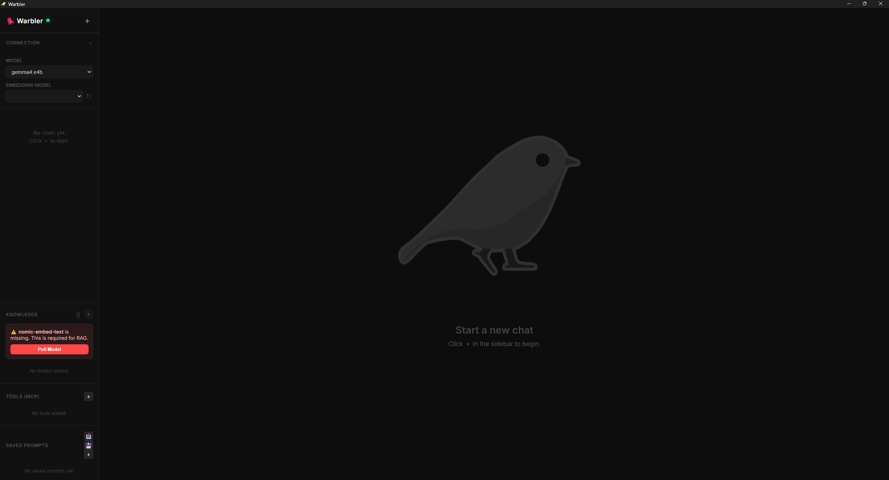

# Warbler 🐦

**Warbler** is a powerful, lightweight, and privacy-focused local AI desktop client. Much like the bird it's named after, Warbler "mimics" sophisticated communication by acting as a universal bridge between you and your local large language models.

Built with **Tauri**, **Svelte**, and **Rust**, Warbler is designed to be fast, secure, and highly extensible.



## ✨ Key Features

-   **🔌 Universal Model Connectivity**: Connect to **Ollama** (default) or any **OpenAI-compatible** backend (like `llama.cpp`).
-   **🎯 Local RAG (Knowledge Folders)**: Index your local directories to give your AI access to your private files for grounding and search.
-   **🔌 MCP Tool Support**: Seamlessly integrate with any **Model Context Protocol** (MCP) server to give your AI powers like web searching, file manipulation, and more.
-   **📝 Saved Prompts**: Maintain a library of your favorite system instructions for quick access.
-   **🖼️ Multimodal Support**: Attach images to your conversations (when supported by the model).
-   **💭 Thinking Progress**: Support for models that output chain-of-thought/reasoning (like DeepSeek).

## 🚀 Getting Started

### Prerequisites

-   [Rust](https://www.rust-lang.org/tools/install)
-   [Deno](https://deno.land/) (or Node.js)
-   An LLM backend (e.g., [Ollama](https://ollama.com/) or [llama.cpp](https://github.com/ggerganov/llama.cpp))

### Setup

1.  Clone the repository:
    ```bash
    git clone https://github.com/JohnnyOrellana/warbler.git
    cd warbler
    ```

2.  Install dependencies:
    ```bash
    deno install
    ```

3.  Run in development mode:
    ```bash
    deno task tauri dev
    ```

4.  Build for production:
    ```bash
    deno task tauri build
    ```

## 🛠️ Tech Stack

-   **Frontend**: Svelte 5, Vanilla CSS
-   **Backend**: Rust (Tauri 2.0)
-   **Database**: SQLite (via SQLx)
-   **Communication**: Model Context Protocol (MCP)

## 📜 Licensing & Assets

> [!IMPORTANT]
> **Code**: This project's source code is licensed under the **MIT License**.
> 
> **Brand & Assets**: The **Warbler icon** and associated branding assets are **Copyright (c) 2026 Johnny Orellana**. You are free to use, modify, and distribute the code, but you may not use the official Warbler icon for your own separate projects without explicit permission.

## 🤝 Contributing

Contributions are welcome! Please feel free to submit a Pull Request or open an issue for bugs and feature requests. See [CONTRIBUTING.md](./CONTRIBUTING.md) for more details.

---

*Made with ❤️ by Johnny Orellana*
